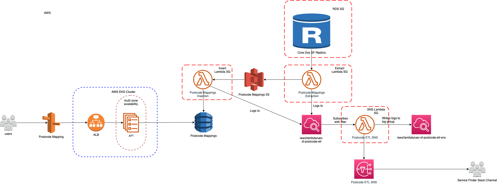

# DoS Postcode API

## Table of Contents

- [DoS Postcode API](#dos-postcode-api)
  - [Table of Contents](#table-of-contents)
  - [Overview](#overview)
  - [Quick Start](#quick-start)
    - [Development Requirements](#development-requirements)
    - [Local Environment Configuration](#local-environment-configuration)
    - [Local Project Setup](#local-project-setup)
    - [Set up IDE](#set-up-ide)
  - [Contributing](#contributing)
  - [Development](#development)
  - [Testing](#testing)
    - [Test data and mock services](#test-data-and-mock-services)
    - [Manual check](#manual-check)
  - [Deployment](#deployment)
    - [Artefact Versioning](#artefact-versioning)
    - [CI/CD Pipelines](#cicd-pipelines)
    - [Deployment From the Command-line](#deployment-from-the-command-line)
    - [Secrets](#secrets)
    - [AWS Access](#aws-access)
  - [Architecture](#architecture)
    - [Diagrams](#diagrams)
      - [System Context Diagram](#system-context-diagram)
      - [Component Diagram](#component-diagram)
      - [Infrastructure / Networking](#infrastructure--networking)
    - [Integration](#integration)
      - [Interfaces](#interfaces)
      - [Dependencies](#dependencies)
    - [Data](#data)
    - [Authentication and authorisation](#authentication-and-authorisation)
    - [Technology Stack](#technology-stack)
    - [Key Architectural Decisions](#key-architectural-decisions)
    - [System Quality Attributes](#system-quality-attributes)
    - [Guiding Principles](#guiding-principles)
  - [Operation](#operation)
    - [Error Handling](#error-handling)
    - [Observability](#observability)
    - [Auditing](#auditing)
    - [Backups](#backups)
    - [Cloud Environments](#cloud-environments)
    - [Runbooks](#runbooks)
  - [Product](#product)
    - [Communications](#communications)

## Overview

This is the DoS Postcode API.  A number of Service Searches require a point to point distance from the search postcode to the services meeting the search criteria to be calculated and returned. To perform this task the northing and easting location coordinates are required.  This API will return northing and easting coordinates for any given UK postcode.

## Quick Start

### Development Requirements

- macOS operating system provisioned with the `curl -L bit.ly/make-devops-macos-setup | bash` command
- `iTerm2` command-line terminal and `Visual Studio Code` source code editor, which will be installed automatically for you in the next steps

### Local Environment Configuration

Clone the repository

    git clone [project-url]
    cd ./[project-dir]

The following is equivalent to the `curl -L bit.ly/make-devops-macos-setup | bash` command

    make macos-setup

Please, ask one of your colleagues for the AWS account numbers used by the project. The next command will prompt you to provide them. This information can be sourced from a properly set up project by running `make show-configuration | grep ^AWS_ACCOUNT_ID_`

    make devops-setup-aws-accounts

Generate and trust a self-signed certificate that will be used locally to enable encryption in transit

    make trust-certificate

### Local Project Setup

  To build the API, run the following make target:

    make build

  To start the API locally, run the following make target:

    make start log

  In the local environment, a mock authentication token is required to be provided in all requests to the API endpoints. Please provide the token of 'MOCK_POSTCODE_API_ACCESS_TOKEN' in the request in order to pass authentication in the local environment.

  Once started, full Swagger API documentation can be found at this endpoint: https://localhost/swagger-ui.html

### Set up IDE

To open application use the command line command as the following

  code project.code-workspace

This is to ensure that the project settings are uniform for all developers.

## Contributing

Here is the list of the development practices that have to be followed by the team and the individual members:

- Only use single canonical branch **master**. Any intermediate branch significantly increases the maintenance overhead of the repository.
- Apply the git rebase workflow and never merge from master to a task branch. Follow the **squash-rebase-merge** pattern to keep the history linear and clean.
- Cryptographically sign your commits using **gpg** to ensure its content have not been tampered with.
- Format the summary message of your pull request (merge request) using the following pattern **"JIRA-XXX Summary of the change being made"** for complines and clarity as well as to enable tooling to produce release notes automatically.
- Announce your PR/MR on the development Slack channel to allow any team member to review it and to share the knowledge. A change can be merged only if all comments have been addressed and it has been **approved by at least one peer**. Make good use of paring/mobbing/swarming practices for collaborative coding.

Before starting any work, please read [CONTRIBUTING.md](documentation/CONTRIBUTING.md) for more detailed instructions.

## Development

This project consists of the following components:

- Springboot API
- DynamoDB
- S3 bucket
- Service extraction and insertion Lambda functions
- Alerting Lambda functions

## Testing

The following test types are present in this project:

- Unit - to run unit tests run the following make target: make unit-test
- Contract - to run contract tests run the following make target: make run-contract-test
- Performance - these tests are run in the performance pipeline
- Load - these tests are run in the load pipeline
- Stress - these tests are run in the stress pipeline
- Smoke - to run smoke tests run the following make target: make run-smoke-test

### Test data and mock services

In the local environment a local DynamoDB is spun up containing test services. The data for the DynamoDB is configured in the /data section of the project.

In the cloud environment, service data is imported into the DynamoDB from the DoS read replica database via the ETL processes. The DoS read replica that the ETL points to is configured in the profile make files for the specific environment.

In the local and in the dev environments, the Authentication mechanism of the API is mocked, and as such, the following token must be provided in API requests: MOCK_POSTCODE_API_ACCESS_TOKEN

In the local environment dynamodb-admin runs on port 8001 to see the table data

### Manual check

Once the application is spun up, use postman to call the available endpoints of the API. Full API documentation can be found at the Swagger endpoint.

## Deployment

The API can be deployed into the dev environment by running the following make target:

  make deploy PROFILE=dev

### Artefact Versioning

This project uses semantic versioning. i.e. 0.0.1 (major, minor, patch)

### CI/CD Pipelines

List all the pipelines and their purpose

- Development - this pipeline is used to plan infrastructure, build and test the API, push the built image to the ECR. The pipeline will be triggered with each code check in.
- Development Deployment - this pipeline is used to create and update infrastructure, deploy a pre-built image, run smoke tests against the deployed image. This pipeline is configured to deploy into the dev environment in the texas nonprod account, and is manually triggered.
- Demo (deployment) - this pipeline is similar to the Development Deployment pipeline, but is deploys to the demo environment in the texas prod account.
- Production (deployment) - this pipeline is similar to the Development Deployment pipeline, but is deploys to the production environment in the texas prod account.
- Performance Test - this pipeline is used to run a performance test suite against the API.
- Load Test - this pipeline is used to run a load test suite against the API.
- Stress Test - this pipeline is used to run a stress test suite against the API.

### Deployment From the Command-line

  To deploy the API into the dev environment directly from the command line, run the following make target:

    make deploy PROFILE=dev IMAGE_TAG=<The image that you want to deploy>

  To deploy (create or update) the infrastructure into the dev environment directly from the command line, run the following make target:

    make terraform-apply PROFILE=dev STACKS=<a list of stacks that you want to apply>
### Secrets

There are no secrets stored in this project.

### AWS Access

To be able to interact with a remote environment, please make sure you have set up your AWS CLI credentials and
MFA to the right AWS account using the following command

    tx-mfa

## Architecture

### Diagrams

#### System Context Diagram

  

#### Component Diagram

  

#### Infrastructure / Networking

  

### Integration

#### Interfaces

Although the API itself does not interface with anything external to this project, the extraction ETL process interface with the Core DoS SF Read Replica RDS.

In addition, the endpoints of the API are protected by a token based authentication mechanism. A token can be retrieved from the Authentication API given user name and password credentials. The token must be present in all requests to the API endpoints, except for the api home pages and swagger documentation.
#### Dependencies

The following are dependencies for this project:

- Core DoS SF Read Replica RDS

### Data

This project stores postcode location information in a DynamoDB datastore. The ETL processes are responsible for inserting and maintaining the data in the datastore whereby the source of the information is extracted out from Core DoS. The API is responsible for returning postcode location information from the datastore via its various endpoints.

### Authentication and authorisation

The endpoints of the API are protected by a token based authentication mechanism. The token itself is generated by a user pool configured in AWS Cognito. The token will contain a set of authorisation groups in which the group 'POSTCODE_API_ACCESS' must be present for the token to be authorised access to the API endpoints.

In the local and dev environments, a mock authentication token of 'MOCK_POSTCODE_API_ACCESS_TOKEN' can be used in the requests to access the API endpoints.

### Technology Stack

The following technology is used in this project:

- Java (Springboot)
- Python
- Terraform
- K8s
- Docker
- JMeter
- Postman

Key AWS Components:

- S3
- Lambda
- Dynamo

### Key Architectural Decisions

Decision records are here: /documentation/adr

- [ADR-001_API_datastore](documentation/adr/ADR-001_API_datastore)
- [ADR-002_ETL_process](documentation/adr/ADR-002_ETLs)

### System Quality Attributes

- Resilience - service operates in multi-AZ and has 3 replicas.
- Performance - high performing DynamoDB for fast retrieval of data.
- Security - all data encrypted at rest and in transit, api endpoints are protected by a token based authentication mechanism
- Supportability - swagger API documentation

### Guiding Principles

The high level principles that the product /development team must adhere to are:

- The solution has to be coded in the open - e.g. NHSD GitHub org
- Be based on the open standards, frameworks and libraries
- API-first design
- Test-first approach
- Apply the automate everything pattern
- AWS-based cloud solution deployable to the NHSD CPaaS Texas platform
- Use of the Make DevOps automation scripts (macOS and Linux)

## Operation

### Error Handling

- Refer to the Swagger API documentation.

### Observability

- Logging

  All API logging is written to Splunk under the following two indexes:

  eks_logs_service_finder_nonprod
  eks_logs_service_finder_prod

  In the event of ETL failure, an error log will be written to the postcode-etl-alerts slack channels. There will be a slack channel per environment.

  Cloudwatch logs for the ETLs are also available under the log group of: /aws/lambda/uec-dos-api-pca-dev...

- Monitoring

  Instana will be used for monitoring of the service. In addition, metrics for the DynamoDB datastore can be obtained from the AWS console.

- Alerting
  TODO

- Fitness functions

  Standard out of the box Instana monitoring is used to measure the fitness of the service.

### Auditing

No auditing is required in this project

### Backups

No backups are required for this project since we do not change the underlying data and the data itself is sourced from Core DoS.

### Cloud Environments

- Development
  - Profile: `dev`
  - URL address: [ https://uec-dos-api-pca-dev-uec-dos-api-pc-ingress.k8s-nonprod.texasplatform.uk/]( https://uec-dos-api-pca-dev-uec-dos-api-pc-ingress.k8s-nonprod.texasplatform.uk/)
- Demo
  - Profile `demo`
  - URL address: [ https://uec-dos-api-pca-demo-uec-dos-api-pc-ingress.k8s-prod.texasplatform.uk/]( https://uec-dos-api-pca-demo-uec-dos-api-pc-ingress.k8s-prod.texasplatform.uk/)
- Live
  - Profile `live`
  - URL address: [ https://uec-dos-api-pca-live-uec-dos-api-pc-ingress.k8s-prod.texasplatform.uk/]( https://uec-dos-api-pca-live-uec-dos-api-pc-ingress.k8s-prod.texasplatform.uk/)

### Runbooks

No runbooks present at this point in time.

## Product

### Communications

- Slack channels
  - ETL alerts: postcode-etl-alerts
