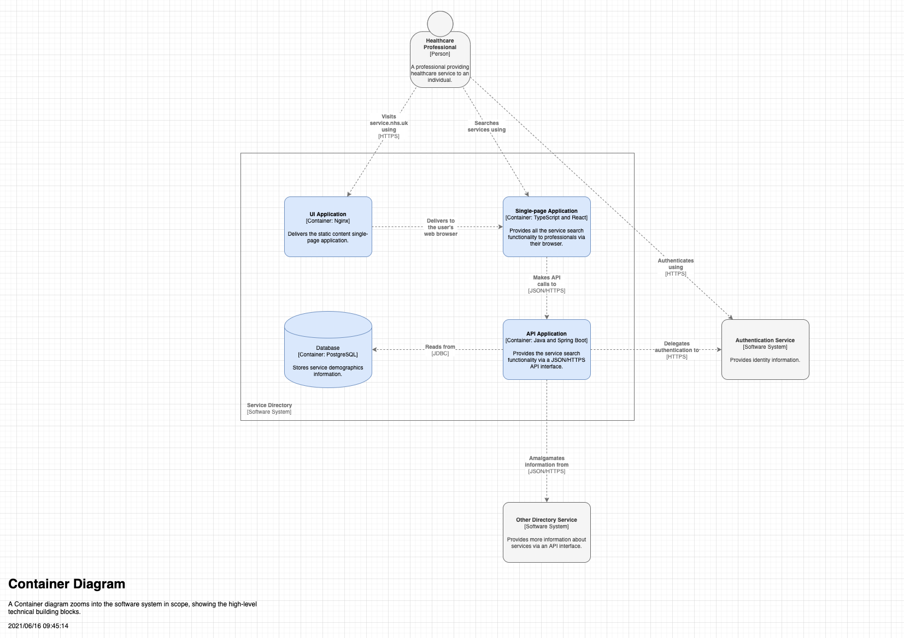

# DoS Postcode API

## Table of Contents

- [DoS Postcode API](#dos-postcode-api)
  - [Table of Contents](#table-of-contents)
  - [Overview](#overview)
  - [Quick Start](#quick-start)
    - [Development Requirements](#development-requirements)
    - [Local Environment Configuration](#local-environment-configuration)
    - [Local Project Setup](#local-project-setup)
  - [Contributing](#contributing)
  - [Development](#development)
  - [Testing](#testing)
    - [Test data and mock services](#test-data-and-mock-services)
    - [Manual check](#manual-check)
  - [Deployment](#deployment)
    - [Artefact Versioning](#artefact-versioning)
    - [CI/CD Pipelines](#cicd-pipelines)
    - [Deployment From the Command-line](#deployment-from-the-command-line)
    - [Secrets](#secrets)
    - [AWS Access](#aws-access)
  - [Architecture](#architecture)
    - [Diagrams](#diagrams)
      - [System Context Diagram](#system-context-diagram)
      - [Container Diagram](#container-diagram)
      - [Component Diagram](#component-diagram)
      - [Processes and Data Flow](#processes-and-data-flow)
      - [Infrastructure](#infrastructure)
      - [Networking](#networking)
    - [Integration](#integration)
      - [Interfaces](#interfaces)
      - [Dependencies](#dependencies)
    - [Data](#data)
    - [Authentication and authorisation](#authentication-and-authorisation)
    - [Technology Stack](#technology-stack)
    - [Key Architectural Decisions](#key-architectural-decisions)
    - [System Quality Attributes](#system-quality-attributes)
    - [Guiding Principles](#guiding-principles)
  - [Operation](#operation)
    - [Error Handling](#error-handling)
    - [Observability](#observability)
    - [Auditing](#auditing)
    - [Backups](#backups)
    - [Cloud Environments](#cloud-environments)
    - [Runbooks](#runbooks)
  - [Product](#product)
    - [Communications](#communications)

## Overview

This is the DoS Postcode API.  A number of Service Searches require a point to point distance from the search postcode to the services meeting the search criteria to be calculated and returned. To perform this task the northing and easting location coordinates are required.  This API will return northing and easting coordinates for any given UK postcode.

## Quick Start

### Development Requirements

- macOS operating system provisioned with the `curl -L bit.ly/make-devops-macos-setup | bash` command
- `iTerm2` command-line terminal and `Visual Studio Code` source code editor, which will be installed automatically for you in the next steps

### Local Environment Configuration

Clone the repository

    git clone [project-url]
    cd ./[project-dir]

The following is equivalent to the `curl -L bit.ly/make-devops-macos-setup | bash` command

    make macos-setup

Please, ask one of your colleagues for the AWS account numbers used by the project. The next command will prompt you to provide them. This information can be sourced from a properly set up project by running `make show-configuration | grep ^AWS_ACCOUNT_ID_`

    make devops-setup-aws-accounts

Generate and trust a self-signed certificate that will be used locally to enable encryption in transit

    make trust-certificate

### Local Project Setup

    make build
    make start log

<<<<<<< HEAD
    Swagger endpoint (default port 443):
    https://localhost/swagger-ui.html
=======
    TODO - Put swagger link in here
    open https://ui.project.local:8443
    # https://localhost:8443/api/search?postcodes=<postcode>
>>>>>>> ea81e0b (Addition of demo and prod deployment jenkins files)

## Contributing

Here is the list of the development practices that have to be followed by the team and the individual members:

- Only use single canonical branch **master**. Any intermediate branch significantly increases the maintenance overhead of the repository.
- Apply the git rebase workflow and never merge from master to a task branch. Follow the **squash-rebase-merge** pattern to keep the history linear and clean.
- Cryptographically sign your commits using **gpg** to ensure its content have not been tampered with.
- Format the summary message of your pull request (merge request) using the following pattern **"JIRA-XXX Summary of the change being made"** for complines and clarity as well as to enable tooling to produce release notes automatically.
- Announce your PR/MR on the development Slack channel to allow any team member to review it and to share the knowledge. A change can be merged only if all comments have been addressed and it has been **approved by at least one peer**. Make good use of paring/mobbing/swarming practices for collaborative coding.

Before starting any work, please read [CONTRIBUTING.md](documentation/CONTRIBUTING.md) for more detailed instructions.

## Development

This project consists of the following components:

- Springboot API
- DynamoDB
- S3 bucket
- Service extraction and insertion Lambda functions
- Alerting Lambda functions

When running locally, the Spingboot API and a local DynamoDB are spun up, containing mocked service data. The S3 and Lambda components are only available in the cloud environments. In the cloud environments the endpoints are authenticated and as such an API token is required to access them.

Refer to the Local Project Setup section to see how to build and start the project locally.

TODO: We need to bypass authentication when running locally.
## Testing

The following tests are setup in this project:

- Unit

TODO: Check this command
To run the unit tests locally, run the following make target:
  make unit-test

- Contract

TODO: Add make target for running contract tests
To run the contract tests locally, run the following make target:
  make

- Performance TODO: We need performance tests

Run using JMeter.

- Smoke

Smoke tests will be run against the cloud environments and are triggered in the pipelines.

TODO: We are here.
### Test data and mock services

In the local environment a local DynamoDB is spun up containing test services. The data for the DynamoDB is configured in the /data section of the project.

In the cloud environment, service data is imported into the DynamoDB from the DoS read replica database via the ETL processes. The DoS read replica that the ETL points to is configured in the profile make files for the specific environment.

Authentication access token to be used:

MOCK_POSTCODE_API_ACCESS_TOKEN

### Manual check

Once the application is spun up, use postman to call the available endpoints of the API. Full API documentation can be found at this endpoint:

TODO: mention swagger endpoint

## Deployment

The API can be deployed into the dev environment by running the following make target:

  make deploy PROFILE=dev

### Artefact Versioning

This project uses semantic versioning. i.e. 0.0.1 (major, minor, patch)

### CI/CD Pipelines

List all the pipelines and their purpose

- Development
- Test
- Cleanup
- Production (deployment)

Reference the [jenkins/README.md](build/automation/lib/jenkins/README.md) file

  

### Deployment From the Command-line

    make deploy PROFILE=dev

### Secrets

Where are the secrets located, i.e. AWS Secrets Manager, under the `$(PROJECT_ID)-$(PROFILE)/deployment` secret name and variable `$(DEPLOYMENT_SECRETS)` should be set accordingly.

### AWS Access

To be able to interact with a remote environment, please make sure you have set up your AWS CLI credentials and
MFA to the right AWS account using the following command

    tx-mfa

## Architecture

### Diagrams

#### System Context Diagram

Include an image of the [C4 model](https://c4model.com/) System Context diagram exported as a `.png` file from the draw.io application.

  

#### Container Diagram

Include an image of the [C4 model](https://c4model.com/) Container diagram exported as a `.png` file from the draw.io application.

  

#### Component Diagram

Include an image of the [C4 model](https://c4model.com/) Component diagram exported as a `.png` file from the draw.io application.

  

#### Processes and Data Flow

Include an image of the Processes and Data Flow diagram

#### Infrastructure

Include an image of the Infrastructure diagram. Please, be aware that any sensitive information that can be potentially misused either directly or indirectly must not be stored and accessible publicly. This could be IP addresses, domain names or detailed infrastructure information.

  

#### Networking

Include an image of the Networking diagram. Please, be aware that any sensitive information must not be stored and accessible publicly. This could be IP addresses, domain names or detailed networking information.

### Integration

#### Interfaces

Document all the system external interfaces

- API documentation should be generated automatically

#### Dependencies

Document all the system external dependencies and integration points

### Data

What sort of data system operates on and processes

- Data set
- Consistency and integrity
- Persistence

### Authentication and authorisation

- Default user login for testing
- Different user roles
- Authosrisation type
- Authentication method

It is recommended that any other documentation related to the aspect of security should be stored in a private workspace.

Authentication access token to be used:

MOCK_POSTCODE_API_ACCESS_TOKEN

### Technology Stack

What are the technologies and programing languages used to implement the solution

### Key Architectural Decisions

Link or include the abbreviated list of the ADRs

### System Quality Attributes

- Accessibility, usability
- Resilience, durability, fault-tolerance
- Scalability, elasticity
- Consistency
- Performance
- Interoperability
- Security
- Supportability

### Guiding Principles

List of the high level principles that a product /development team must adhere to:

- The solution has to be coded in the open - e.g. NHSD GitHub org
- Be based on the open standards, frameworks and libraries
- API-first design
- Test-first approach
- Apply the automate everything pattern
- AWS-based cloud solution deployable to the NHSD CPaaS Texas platform
- Use of the Make DevOps automation scripts (macOS and Linux)

## Operation

### Error Handling

- What is the system response under the erroneous conditions

### Observability

- Logging
  - Indexes
  - Format
- Tracing
  - Correlation ID
- Monitoring
  - Dashboards
- Alerting
  - Triggers
  - Service status
- Fitness functions
  - What do we measure?

What are the links of the supporting systems?

### Auditing

Are there any auditing requirements in accordance with the data retention policies?

### Backups

- Frequency and type of the backups
- Instructions on how to recover the data

### Cloud Environments

List all the environments and their relation to profiles

- Development
  - Profile: `dev`
  - URL address: [https://?.k8s-dev.texasplatform.uk/](https://?.k8s-dev.texasplatform.uk/)
  - Username: ?@nhs.net
  - Password: _stored in the AWS Secrets Manager `?`_
- Test
- Demo
- Live

Describe how to provision and deploy to a task branch environment

### Runbooks

List all the operational runbooks

## Product

### Communications

- Slack channels
  - Development, e.g. `[service-name]-development`
  - CI/CD and data pipelines, processes, e.g. `[service-name]-automation`
  - Service status, e.g. `[service-name]-status`
- Email addresses in use, e.g. `[service.name]@nhs.net`

All of the above can be service, product, application or even team specific.
